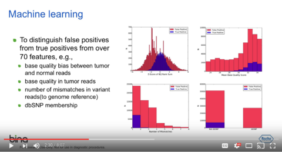

<b>SomaticSeq: An ensemble approach to accurately detect somatic mutations</b>
* Detailed documentation is included in the package. It's located in [docs/Manual.pdf](docs/Manual.pdf "User Manual"). Quick guide can be found [here](http://bioinform.github.io/somaticseq/).
* SomaticSeq's open-access paper published in [Genome Biology](http://dx.doi.org/10.1186/s13059-015-0758-2 "Fang LT, Afshar PT, Chhibber A, et al. An ensemble approach to accurately detect somatic mutations using SomaticSeq. Genome Biol. 2015;16:197.").
* Feel free to report issues and/or ask questions at the [Issues](../../issues "Issues") page.

<b>An example command:</b>
```
$somaticseq/SomaticSeq.Wrapper.sh \
--output-dir       /PATH/TO/RESULTS/SomaticSeq_MVSDULPK \
--genome-reference /PATH/TO/GRCh38.fa \
--tumor-bam        /PATH/TO/HCC1395.bam \
--normal-bam       /PATH/TO/HCC1395BL.bam \
--dbsnp            /PATH/TO/dbSNP.GRCh38.vcf \
--cosmic           /PATH/TO/COSMIC.v77.vcf \
--mutect2          /PATH/TO/RESULTS/MuTect2.vcf \
--varscan-snv      /PATH/TO/RESULTS/VarScan2.snp.vcf \
--varscan-indel    /PATH/TO/RESULTS/VarScan2.indel.vcf \
--sniper           /PATH/TO/RESULTS/SomaticSniper.vcf \
--vardict          /PATH/TO/RESULTS/VarDict.vcf \
--muse             /PATH/TO/RESULTS/MuSE.vcf \
--lofreq-snv       /PATH/TO/RESULTS/LoFreq.somatic_final.snvs.vcf.gz \
--lofreq-indel     /PATH/TO/RESULTS/LoFreq.somatic_final.indels.vcf.gz \
--scalpel          /PATH/TO/RESULTS/Scalpel.vcf \
--strelka-snv      /PATH/TO/RESULTS/Strelka/results/variants/somatic.snvs.vcf.gz \
--strelka-indel    /PATH/TO/RESULTS/Strelka/results/variants/somatic.indels.vcf.gz \
--inclusion-region /PATH/TO/RESULTS/captureRegion.bed \
--exclusion-region /PATH/TO/RESULTS/blackList.bed \
--gatk             /opt/GATK/GenomeAnalysisTK.jar
```
* For all those VCF files, either .vcf or .vcf.gz are acceptable. 
* You must make sure all the input files (i.e., VCF, BAM, FASTA, etc.) are sorted the same way. Otherwise, the results would not be valid.
* Some additional parameters:
    * --truth-snv: if you have ground truth VCF file for SNV
    * --truth-indel: if you have a ground truth VCF file for INDEL
    * --ada-r-script $somaticseq/r_scripts/ada_model_builder_ntChange.R to train, if you have ground truths supplised.
    * --classifier-snv: classifier previously built for SNV
    * --classifier-indel: classifier previously built for INDEL
    * --ada-r-script $somaticseq/r_scripts/ada_model_predictor.R to use the classifiers specified above to make predictions
    * Do not worry if Python throws the following warning. This occurs when SciPy attempts a statistical test with empty data, e.g., when there is no variant read in the matched normal, resulting in NaN in the output.
   ```
     RuntimeWarning: invalid value encountered in double_scalars
     z = (s - expected) / np.sqrt(n1*n2*(n1+n2+1)/12.0)
   ```

<b>Dockerized Pipelines</b>
* The docker repo for SomaticSeq is at https://hub.docker.com/r/lethalfang/somaticseq/.
* We also have run script generators for the dockerized somatic mutation callers at [utilities/dockered_pipelines](utilities/dockered_pipelines).
The documentation for those scripts are in Section 4 of the [User's Manual](docs/Manual.pdf "Documentation").
* The pipeline to generate training data out of your own sequencing data based on [BAMSurgeon](https://github.com/adamewing/bamsurgeon) is located at [utilities/dockered_pipelines/bamSimulator](utilities/dockered_pipelines/bamSimulator).
* The limited alignment pipeline to generate BAM files based on GATK's best practices is at [utilities/dockered_pipelines/alignments](utilities/dockered_pipelines/alignments).
* Most of the dockerized pipelines are ported to singularity at [utilities/singularities](utilities/singularities), although they may not be as extensively tested or optimized as the dockered ones.

<b>For a quick description of SomaticSeq, you may watch this 8-minute video:</b>
  [](https://www.youtube.com/watch?v=MnJdTQWWN6w "SomaticSeq Video")
