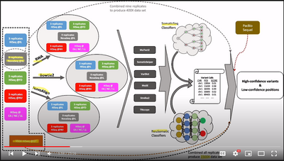

# SEQC2 branch

* This is a special release of the SEQC2 Somatic Mutation Working Group to establish cancer reference samples. This is based on SomaticSeq v2.8.1, which has been obsolesced by the [current version](https://github.com/bioinform/somaticseq).
* The work was published in [Fang, L.T., Zhu, B., Zhao, Y. _et al_. Establishing community reference samples, data and call sets for benchmarking cancer mutation detection using whole-genome sequencing. _Nat Biotechnol 39, 1151–1160 (2021)_](https://doi.org/10.1038/s41587-021-00993-6), or [SharedIt Link](https://rdcu.be/cxs3D).
* Many custom scripts were created specifically to complete the [SEQC2](https://www.fda.gov/science-research/bioinformatics-tools/microarraysequencing-quality-control-maqcseqc#MAQC_IV) project. For regular uses of SomaticSeq, please use the ([main](https://github.com/bioinform/somaticseq)) branch.


# SEQC2 Somatic Mutation Working Group Data
* Analysis documentation and latest updates about the SEQC2 somatic mutation project can be found at [**https://sites.google.com/view/seqc2**](https://sites.google.com/view/seqc2).
* The [**latest** high-confidence somatic reference call set](https://ftp-trace.ncbi.nlm.nih.gov/ReferenceSamples/seqc/Somatic_Mutation_WG/release/latest/) can be found at the NCBI FTP site.
  * Alternate FTP address: ftp://ftp-trace.ncbi.nlm.nih.gov/ReferenceSamples/seqc/Somatic_Mutation_WG/release
* All the raw sequencing data (FASTQ files) generated by the working group were deposited into [**NCBI SRA database: SRP162370**](https://trace.ncbi.nlm.nih.gov/Traces/sra/?study=SRP162370)
* Some BAM files can be found [here](https://ftp-trace.ncbi.nlm.nih.gov/ReferenceSamples/seqc/Somatic_Mutation_WG/data/WGS/) as well.
  * Alternate FTP address: ftp://ftp-trace.ncbi.nlm.nih.gov/ReferenceSamples/seqc/Somatic_Mutation_WG/data/


## Video presentation: building the reference call set for the SEQC2 consortium
  [](https://youtu.be/nn0BOAONRe8 "SEQC2 Video")


# SEQC2 Custom Scripts

## To re-create reference call set v1.2
* The script we used to generate the latest reference call set is [utilities/makeSeqc2HighConfidenceCallSets/makeTruthSet.sh](utilities/makeSeqc2HighConfidenceCallSets/makeTruthSet.sh).
* The steps are documented with greater details [here](https://sites.google.com/view/seqc2/home/data-analysis/high-confidence-somatic-snv-and-indel-v1-2).
* To re-create v1.2 of the call set with this script, please first download the data files at `ftp://ftp-trace.ncbi.nlm.nih.gov/ReferenceSamples/seqc/Somatic_Mutation_WG/analysis/cancer_reference_samples_supporting_files/data_to_recreate_call_set_v1-2.tar.gz`, and then unpack it. Read the README.md there. You'll also need to run `download_files.sh` there because you'll need to download additional files. Then you may use our docker image to run the (command specified in the README.md there).

### For the impatient, you can just run the following commands to re-create the reference call set v1.2
```
wget ftp://ftp-trace.ncbi.nlm.nih.gov/ReferenceSamples/seqc/Somatic_Mutation_WG/analysis/cancer_reference_samples_supporting_files/data_to_recreate_call_set_v1-2.tar.gz
tar -vxf data_to_recreate_call_set_v1-2.tar.gz
cd data_to_recreate_call_set_v1-2
./download_files.sh
docker run --rm -u $UID:$UID --workdir /seqc2 -v $(pwd -P):/seqc2 lethalfang/somaticseq:seqc2_v1.2 /opt/somaticseq/utilities/makeSeqc2HighConfidenceCallSets/makeTruthSet.sh
```


## Analysis scripts
* [seqc2_calculateProbablyOfLowVafCalls.py](utilities/seqc2_calculateProbablyOfLowVafCalls.py) calculates the binomial probability that a somatic mutation would be missed entirely in our high-confidence regions due to low variant allele frequency [Suppl. Sec. 1.7].
  * `utilities/seqc2_calculateProbablyOfLowVafCalls.py -vaf 0.05 0.03 -deep1 175 -deep2 200` shows 
    * At VAF = 0.05, the chances that the variant will be called in at least one out of 21 WGS replicates is approximately 0.99999755 (or it'll be missed entirely at about 2.5 x 10<sup>-6</sup> probability). The chances that it'll receive majority support is about 0.373450. However, the chances that it'll be rescued by higher depth data is approximately 0.994400. 
    * At VAF = 0.03, the three numbers are 0.987777, 0.003745 and 0.845741.
* [estimate_SequencingErrorRate.py](utilities/estimate_SequencingErrorRate.py) estimates overall sequencing error in a BAM file by assuming every base within a BED file is a reference base. The BAM files are normal samples. The BED file is the high-confidence region minus the germline variant positions (Suppl. Table 2).


# Requirement for this SEQC2 release
In order to run `utilities/makeSeqc2HighConfidenceCallSets/makeTruthSet.sh`, the following software need to be installed
* Python 3, plus regex, pysam, numpy, scipy, pandas, xlrd, and openpyxl libraries
* SomaticSeq v3.6.2
* bedtools
* vcftools
* tabix

Alternatively, a docker image is also available at docker hub: `lethalfang/somaticseq:seqc2_v1.2`.


## NOTE
If you have issue navigating FTP site on Chrome, try to enable "Enable support for FTP URLs" in chrome://flags/.
