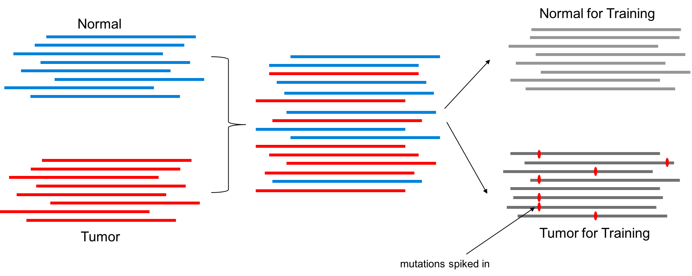

<b>Dockerized *in silico* somatic mutation spike in pipeline to generate training data set with ground truths</b>
* This pipeline is used to spike in *in silico* somatic mutations into existing BAM files to create semi-synthetic data set.
* After the *in silico* data are generated, you can use the [somatic mutation pipeline](..) on the training data to generate the SomaticSeq classifiers.
* Classifiers built on training data only work if the training data is similar to the data you want to predict. Ideally, the training data are sequenced on the same platform, same sample prep, and similar depth of coverage as the data of interest.
* The spike in is based on [BAMSurgeon](https://github.com/adamewing/bamsurgeon) slightly modified.

**Requirement**
* Have internet connection, and able to pull and run docker images from Docker Hub, as we have dockerized the entire BAMSurgeon workflow. 
* **Recommended**: Have cluster management system with valid "qsub" command, such as Sun Grid Engine (SGE).

**Example Command for multi-thread jobs**
```
$PATH/TO/somaticseq/utilities/dockered_pipelines/bamSimulator/BamSimulator_multiThreads.sh \
--genome-reference  /ABSOLUTE/PATH/TO/GRCh38.fa \
--selector          /ABSOLUTE/PATH/TO/Exome_Capture.GRCh38.bed \
--tumor-bam-in      /ABSOLUTE/PATH/TO/Tumor_Sample.bam \
--normal-bam-in     /ABSOLUTE/PATH/TO/Normal_Sample.bam \
--tumor-bam-out     syntheticTumor.bam \
--normal-bam-out    syntheticNormal.bam \
--split-proportion  0.5 \
--num-snvs          30000 \
--num-indels        10000 \
--num-svs           1500 \
--min-vaf           0.0 \
--max-vaf           1.0 \
--left-beta         2 \
--right-beta        5 \
--min-variant-reads 2 \
--output-dir        /ABSOLUTE/PATH/TO/trainingSet \
--threads           36 \
--action            qsub
--merge-bam --split-bam --indel-realign --merge-output-bams
```

* **BamSimulator_.sh** creates semi-simulated tumor-normal pairs out of your input tumor-normal pairs. The "ground truth" of the somatic mutations will be **synthetic_snvs.vcf**, **synthetic_indels.vcf**, and **synthetic_svs.vcf**.
* For single-thread job (WES), use BamSimulator_singleThread.sh instead. 

**The following parameters for the script:**
* ```--genome-reference``` /ABSOLUTE/PATH/TO/human_reference.fa (Required)
* ```--selector``` /ABSOLUTE/PATH/TO/capture_region.bed (Required)
* ```--tumor-bam-in``` Input BAM file (Required)
* ```--normal-bam-in``` Input BAM file (Optional, but required if you want to merge it with the tumor input)
* ```--tumor-bam-out``` Output BAM file for the designated tumor after BAMSurgeon mutation spike in
* ```--normal-bam-out``` Output BAM file for the designated normal if --split-bam is chosen
* ```--split-proportion``` The faction of total reads desginated to the normal. (Defaut = 0.5)
* ```--num-snvs``` Number of SNVs to spike into the designated tumor
* ```--num-indels``` Number of INDELs to spike into the designated tumor
* ```--num-svs``` Number of SVs to spike into the designated tumor (Default = 0)
* ```--min-depth``` Minimum depth where spike in can take place
* ```--max-depth``` Maximum depth where spike in can take place
* ```--min-vaf``` Minimum VAF to simulate
* ```--max-vaf``` Maximum VAF to simulate
* ```--left-beta``` Left beta of beta distribution for VAF
* ```--right-beta``` Right beta of beta distribution for VAF
* ```--min-variant-reads``` Minimum number of variant-supporting reads for a successful spike in
* ```--output-dir``` Output directory
* ```--merge-bam``` Flag to merge the tumor and normal bam file input
* ```--split-bam``` Flag to split BAM file for tumor and normal
* ```--clean-bam``` Flag to go through the BAM file and remove reads where more than 2 identical read names are present. This was necessary for some BAM files downloaded from TCGA. However, a proper pair-end BAM file should not have the same read name appearing more than twice. Use this only when necessary. 
* ```--indel-realign``` Conduct GATK Joint Indel Realignment on the two output BAM files. Instead of syntheticNormal.bam and syntheticTumor.bam, the final BAM files will be **syntheticNormal.JointRealigned.bam** and **syntheticTumor.JointRealigned.bam**.
* ```--seed``` Random seed. Pick any integer for reproducibility purposes.
* ```--threads``` Split the BAM files evenly in N regions, then process each (pair) of sub-BAM files in parallel. 
* ```--action``` The command preceding the run script created into /ABSOLUTE/PATH/TO/BamSurgeoned_SAMPLES/logs. "qsub" is to submit the script in SGE system. Default = echo


**Recommendations for a few scenario for --merge-bam / --split-bam / --indel-realign**
1) If you have sequenced replicate normal, that's pretty good data set for training. You can use one of the normal as normal, and designate the other normal (of the same sample) as tumor. Use ```--indel-realign``` only. You don't need to merge them.
2) When you have a normal that's roughly 2X the coverage as your data of choice, you can split that into two halves. One designated as normal, and the other one designated as tumor. That [DREAM Challenge's approach](https://www.synapse.org/#!Synapse:syn312572/wiki/62018). Use ```--split-bam --indel-realign```.
3) Another approach is to merge the tumor and normal data, and then randomly split them as described above. When you merge the tumor and normal, the real tumor mutations are relegated as germline or noise, so they are considered false positives, because they are supposed to be evenly split into the designated normal. To take this approach, use ```--merge-bam --split-bam --indel-realign```.
* Don't use --indel-realign if you do not use indel realignment in your alignment pipeline. 
* You can visualize the shape of VAF distribution with python command (scipy.stats as stats, numpy as np):
``` 
    import scipy.stats as stats
    import numpy as np
    import matplotlib.pyplot as plt

    x = np.linspace(0,1,101)
    y = stats.beta.pdf(x, leftBeta, rigthBeta, loc = minAF, scale = minAF + maxAF)
    _ = plt.plot(x, y)
```

**What does that command do**

This is a workflow created using modified [BAMSurgeon](https://github.com/ltfang-bina/bamsurgeon).
The ```--merge-bam``` will merge the normal and tumor BAM files into a single BAM file. Then, ```--split-bem``` will randomly split the merged BAM file into two BAM files.
One of which is designated normal, and one of which is designated tumor. 
Synthetic mutations will then be spiked into the designated tumor to create "real" mutations.
This is the approach described in our [2017 AACR Abstract](http://dx.doi.org/10.1158/1538-7445.AM2017-386). 

<b>A schematic of the simulation procedure (scenario #3 as described above)</b>
  
